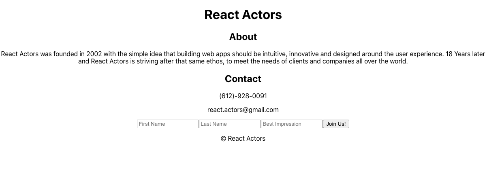

This project was bootstrapped with [Create React App](https://github.com/facebook/create-react-app).

## Available Scripts

in the terminal run: `npm start`

Runs the app in the development mode. 
Open [http://localhost:3000](http://localhost:3000) to view it in the browser.

## Screenshot

## Basic Use

1. input first name, last name and your best impression and see it on the DOM
2. hit join us to see an alert and reset fields